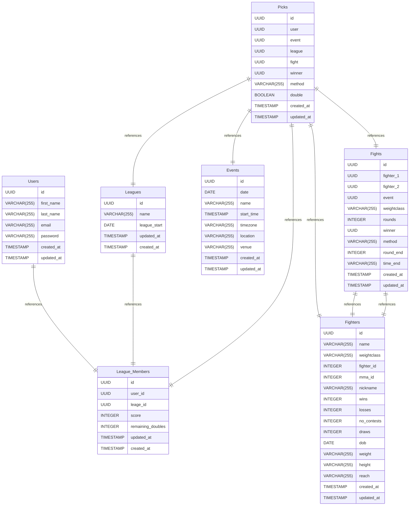

# Untitled Diagram documentation
## Summary

- [Introduction](#introduction)
- [Database Type](#database-type)
- [Table Structure](#table-structure)
	- [Users](#Users)
	- [Leagues](#Leagues)
	- [League_Members](#League_Members)
	- [Fighters](#Fighters)
	- [Events](#Events)
	- [Fights](#Fights)
	- [Picks](#Picks)
- [Relationships](#relationships)
- [Database Diagram](#database-Diagram)

## Introduction

## Database type

- **Database system:** PostgreSQL
## Table structure

### Users

| Name        | Type          | Settings                      | References                    | Note                           |
|-------------|---------------|-------------------------------|-------------------------------|--------------------------------|
| **id** | UUID | 🔑 PK, not null, unique | fk_Users_id_League_Members | |
| **first_name** | VARCHAR(255) | not null |  | |
| **last_name** | VARCHAR(255) | not null |  | |
| **email** | VARCHAR(255) | not null |  | |
| **password** | VARCHAR(255) | not null |  | |
| **created_at** | TIMESTAMP | not null |  | |
| **updated_at** | TIMESTAMP | not null |  | | 

### Leagues

| Name        | Type          | Settings                      | References                    | Note                           |
|-------------|---------------|-------------------------------|-------------------------------|--------------------------------|
| **id** | UUID | 🔑 PK, not null, unique | fk_Leagues_id_League_Members | |
| **name** | VARCHAR(255) | not null |  | |
| **league_start** | DATE | not null |  | |
| **updated_at** | TIMESTAMP | not null |  | |
| **created_at** | TIMESTAMP | not null |  | | 

### League_Members

| Name        | Type          | Settings                      | References                    | Note                           |
|-------------|---------------|-------------------------------|-------------------------------|--------------------------------|
| **id** | UUID | 🔑 PK, not null, unique |  | |
| **user_id** | UUID | not null |  | |
| **leage_id** | UUID | not null |  | |
| **score** | INTEGER | not null, default: 0 |  | |
| **remaining_doubles** | INTEGER | not null |  | |
| **updated_at** | TIMESTAMP | not null |  | |
| **created_at** | TIMESTAMP | not null |  | | 

### Fighters

| Name        | Type          | Settings                      | References                    | Note                           |
|-------------|---------------|-------------------------------|-------------------------------|--------------------------------|
| **id** | UUID | 🔑 PK, not null, unique |  | |
| **name** | VARCHAR(255) | not null |  | |
| **weightclass** | VARCHAR(255) | null |  | |
| **fighter_id** | INTEGER | null |  | |
| **mma_id** | INTEGER | null |  | |
| **nickname** | VARCHAR(255) | null |  | |
| **wins** | INTEGER | null |  | |
| **losses** | INTEGER | null |  | |
| **no_contests** | INTEGER | null |  | |
| **draws** | INTEGER | null |  | |
| **dob** | DATE | null |  | |
| **weight** | VARCHAR(255) | null |  | |
| **height** | VARCHAR(255) | null |  | |
| **reach** | VARCHAR(255) | null |  | |
| **created_at** | TIMESTAMP | not null |  | |
| **updated_at** | TIMESTAMP | not null |  | | 

### Events

| Name        | Type          | Settings                      | References                    | Note                           |
|-------------|---------------|-------------------------------|-------------------------------|--------------------------------|
| **id** | UUID | 🔑 PK, not null, unique |  | |
| **date** | DATE | not null |  | |
| **name** | VARCHAR(255) | not null |  | |
| **start_time** | TIMESTAMP | null |  | |
| **timezone** | VARCHAR(255) | null |  | |
| **location** | VARCHAR(255) | null |  | |
| **venue** | VARCHAR(255) | null |  | |
| **created_at** | TIMESTAMP | not null |  | |
| **updated_at** | TIMESTAMP | not null |  | | 

### Fights

| Name        | Type          | Settings                      | References                    | Note                           |
|-------------|---------------|-------------------------------|-------------------------------|--------------------------------|
| **id** | UUID | 🔑 PK, not null, unique |  | |
| **fighter_1** | UUID | not null | fk_Fights_fighter_1_Fighters | |
| **fighter_2** | UUID | not null | fk_Fights_fighter_2_Fighters | |
| **event** | UUID | not null |  | |
| **weightclass** | VARCHAR(255) | null |  | |
| **rounds** | INTEGER | null |  | |
| **winner** | UUID | null |  | |
| **method** | VARCHAR(255) | null |  | |
| **round_end** | INTEGER | null |  | |
| **time_end** | VARCHAR(255) | null |  | |
| **created_at** | TIMESTAMP | not null |  | |
| **updated_at** | TIMESTAMP | not null |  | | 

### Picks

| Name        | Type          | Settings                      | References                    | Note                           |
|-------------|---------------|-------------------------------|-------------------------------|--------------------------------|
| **id** | UUID | 🔑 PK, not null, unique |  | |
| **user** | UUID | not null | fk_Picks_user_League_Members | |
| **event** | UUID | not null | fk_Picks_event_Events | |
| **league** | UUID | not null | fk_Picks_league_Leagues | |
| **fight** | UUID | not null | fk_Picks_fight_Fights | |
| **winner** | UUID | not null | fk_Picks_winner_Fighters | |
| **method** | VARCHAR(255) | not null |  | |
| **double** | BOOLEAN | not null |  | |
| **created_at** | TIMESTAMP | not null |  | |
| **updated_at** | TIMESTAMP | not null |  | | 

## Relationships

- **Users to League_Members**: one_to_one
- **Leagues to League_Members**: one_to_one
- **Picks to League_Members**: one_to_one
- **Picks to Events**: one_to_one
- **Picks to Leagues**: one_to_one
- **Picks to Fights**: one_to_one
- **Picks to Fighters**: one_to_one
- **Fights to Fighters**: one_to_one
- **Fights to Fighters**: one_to_one

## Database Diagram

